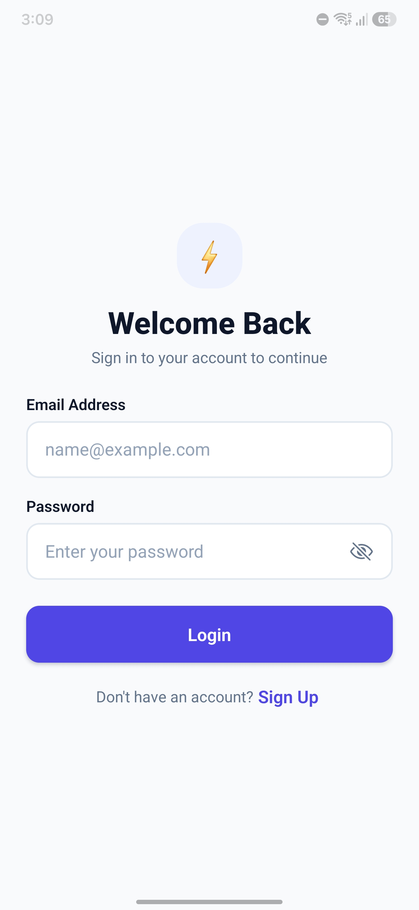
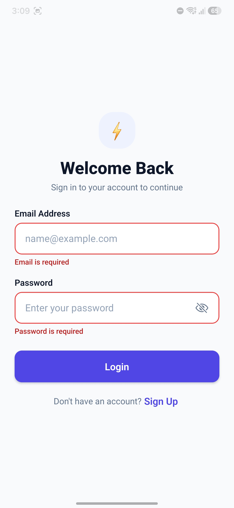
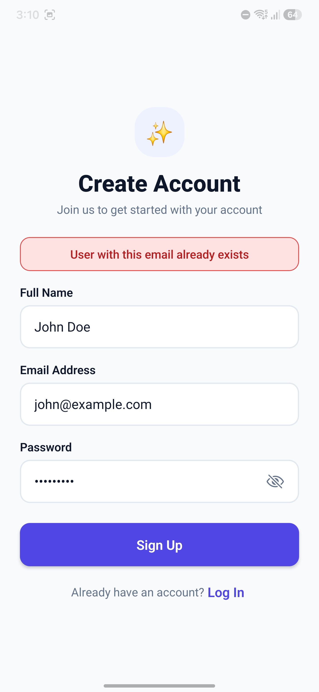
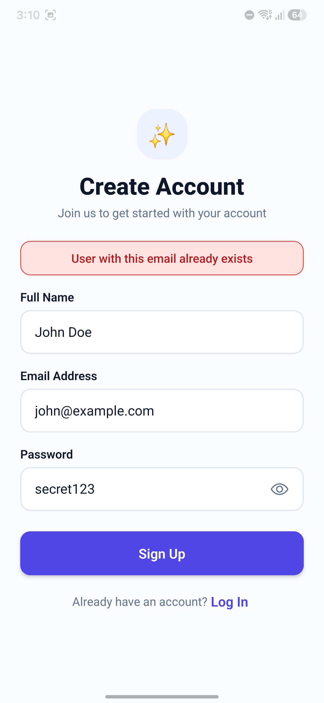
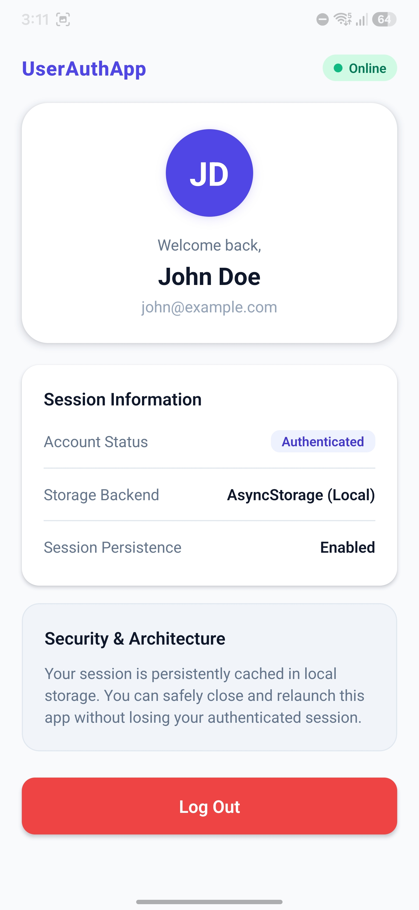
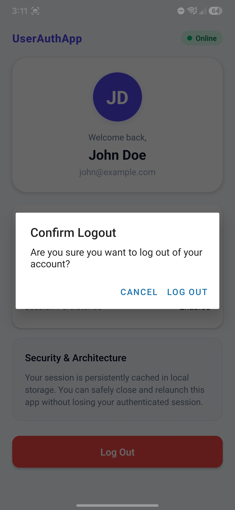
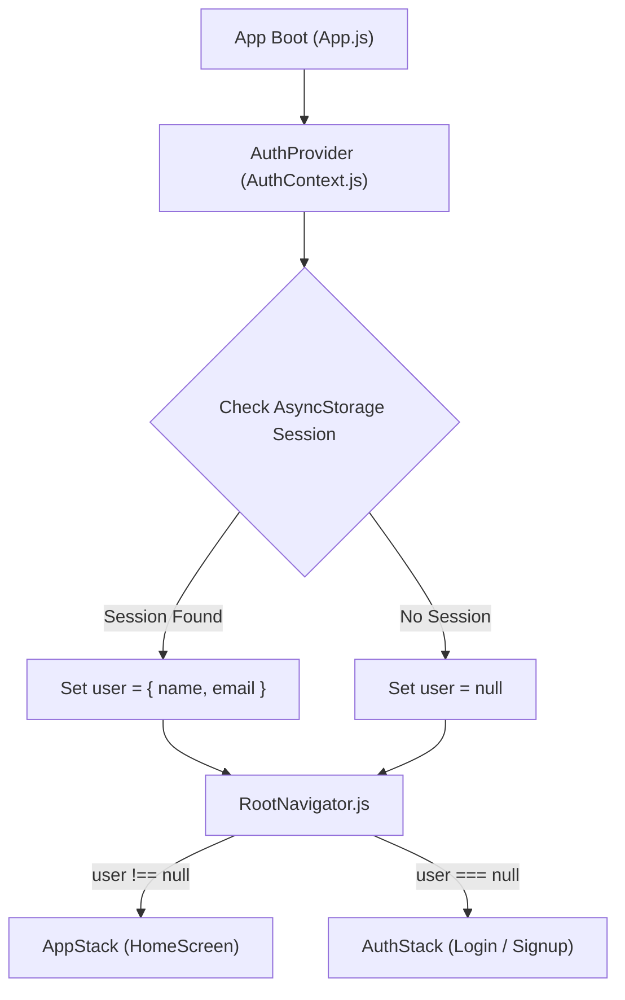

# 🚀 User Authentication App (React Native & Expo)

A cross-platform React Native authentication application developed with **Expo**, **React Navigation**, and an **AsyncStorage** mock backend. The app features state-driven conditional navigation, real-time input validation, session persistence across launches, and interactive password visibility toggles.

---

## 📱 Features

- **Conditional Navigation Flow**: Seamless switching between `AuthStack` (Login/Signup) and `AppStack` (Home Dashboard) driven by `AuthContext`.
- **Mock Backend with AsyncStorage**: Persistent storage of registered users (`@auth_users_store`) and active user session (`@auth_current_user_session`).
- **Session Restoration on Launch**: On cold launch, the app checks for an active session and seamlessly restores the authenticated state without flashing login screens.
- **Robust Form Validation**:
  - All fields mandatory with real-time and submit-time feedback.
  - Email format validation using standard regex pattern (`/^[^\s@]+@[^\s@]+\.[^\s@]+$/`).
  - Password strength validation ($\ge 6$ characters).
  - Uniqueness check for email registration (case-insensitive duplicate check).
  - Error banners for invalid credentials or unexpected I/O exceptions.
- **Bonus Feature — Password Visibility Toggle**: Eye / Eye-off icon toggle (`@expo/vector-icons` Ionicons) enabling users to obscure or reveal their password.
- **UI/UX Polish**:
  - `KeyboardAvoidingView` configured conditionally (`padding` for iOS, default for Android) with `TouchableWithoutFeedback` keyboard dismissal.
  - Safe area padding on all screens with `react-native-safe-area-context`.
  - Cohesive design system tokens (`src/styles/theme.js`).

---

## 📸 Application Screenshots

| 1. Login Screen | 2. Field Validation Errors | 3. Duplicate Email Error |
|:---:|:---:|:---:|
|  |  |  |

| 4. Password Toggle (Bonus) | 5. Authenticated Dashboard | 6. Logout Confirmation |
|:---:|:---:|:---:|
|  |  |  |

---

## 🔒 Security Note (Architecture & Production Readiness)

> [!NOTE]
> **Mock Backend Disclaimer**: This project uses `@react-native-async-storage/async-storage` as a client-side mock backend for demonstration and assessment purposes.
> 
> In a **production deployment**:
> 1. Passwords would **never** be stored locally or transmitted in plain text. A production backend would salt and hash passwords using algorithms such as **bcrypt** or **argon2**.
> 2. Active sessions would be managed via secure tokens (JWT or OAuth refresh/access tokens) stored securely in hardware-backed encrypted storage using **`expo-secure-store`** (Keychain on iOS and EncryptedSharedPreferences/Keystore on Android) rather than unencrypted AsyncStorage.

---

## 🏗️ Architecture Overview



### Directory Structure
```text
user-auth-app/
├── assets/
│   ├── screenshots/              # Application demonstration screenshots
│   └── ...                       # App icons and splash screen assets
├── src/
│   ├── components/
│   │   ├── CustomInput.js        # Form input with focus state, errors & eye toggle
│   │   └── CustomButton.js       # Reusable button (primary, secondary, link, danger)
│   ├── context/
│   │   └── AuthContext.js        # Auth state provider and hooks (useAuth)
│   ├── navigation/
│   │   ├── RootNavigator.js      # Conditional stack router based on auth state
│   │   ├── AuthStack.js          # Unauthenticated stack (Login, Signup)
│   │   └── AppStack.js           # Authenticated stack (Home)
│   ├── screens/
│   │   ├── LoginScreen.js        # Login form with validation & bad-credentials banner
│   │   ├── SignupScreen.js       # Signup form with duplicate email check
│   │   └── HomeScreen.js         # Protected dashboard with profile, session info & logout
│   ├── utils/
│   │   ├── validation.js         # Form field & regex validation utilities
│   │   └── storage.js            # AsyncStorage mock backend operations
│   └── styles/
│       └── theme.js              # Theme tokens (colors, typography, spacing, shadows)
├── __tests__/
│   ├── validation.test.js        # Automated unit tests for validation rules
│   └── storage.test.js           # Automated unit tests for storage mock backend
├── App.js                        # Root entry point with providers
├── babel.config.js               # Babel configuration
├── package.json
└── README.md
```

---

## 📦 Prerequisites

- **Node.js**: `v18+` (tested with Node `v25.2.1`)
- **npm** or **yarn**
- **Expo Go** app on your physical iOS or Android device, or an iOS Simulator / Android Emulator.

---

## 🚀 Setup & Running Instructions

1. **Clone the repository:**
   ```bash
   git clone <your-repo-url>
   cd user-auth-app
   ```

2. **Install dependencies:**
   ```bash
   npm install
   ```

3. **Start the Expo development server:**
   ```bash
   npx expo start
   ```

4. **Run on your device or simulator:**
   - Press `a` in the terminal to open on an Android emulator.
   - Press `i` to open on an iOS simulator (macOS required).
   - Press `w` to open in a web browser.
   - Scan the terminal QR code using the **Expo Go** app on your phone.

5. **Run the automated unit tests:**
   ```bash
   npm test
   ```

---

## 🧪 Testing & Verification Matrix

The application covers all 9 test scenarios specified in the roadmap:

| # | Test Case | Action | Expected Result | Status |
|---|:---|:---|:---|:---:|
| 1 | **Empty Form Submission** | Submit Login or Signup with empty inputs | Validation error messages appear below each field ("Email is required", etc.) | ✅ Verified |
| 2 | **Invalid Email** | Enter `notanemail` and submit | "Please enter a valid email address" appears | ✅ Verified |
| 3 | **Short Password (< 6 chars)** | Enter password with < 6 characters | "Password must be at least 6 characters" appears | ✅ Verified |
| 4 | **Signup Success** | Submit valid Name, Email, Password | User saved to storage; automatically redirected to Home screen with personalized greeting | ✅ Verified |
| 5 | **Duplicate Signup** | Sign up with an already registered email | "User with this email already exists" error banner displayed | ✅ Verified |
| 6 | **Login with Wrong Password** | Enter registered email with incorrect password | "Invalid email or password" error banner displayed | ✅ Verified |
| 7 | **Password Toggle (Bonus)** | Click eye icon in password field | Obscured dots switch to readable text and back with icon state change | ✅ Verified |
| 8 | **Session Persistence** | Close and relaunch the app | App restores session from AsyncStorage; user stays logged into Home screen | ✅ Verified |
| 9 | **Logout** | Tap "Log Out" on Home screen | AsyncStorage session cleared; app resets immediately to Login screen | ✅ Verified |

